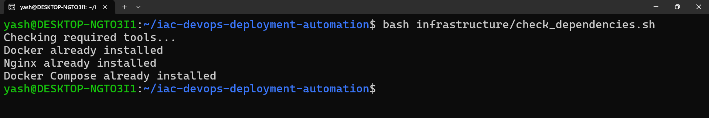
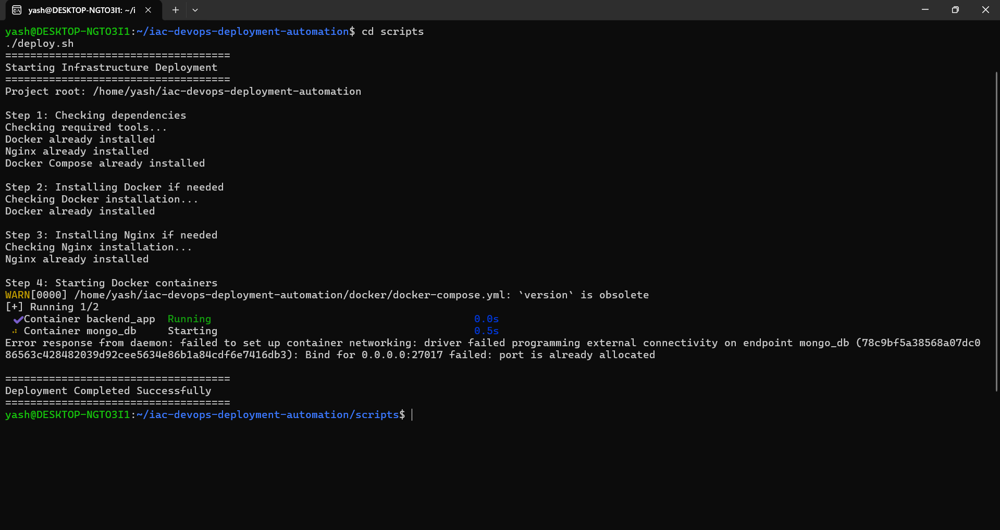
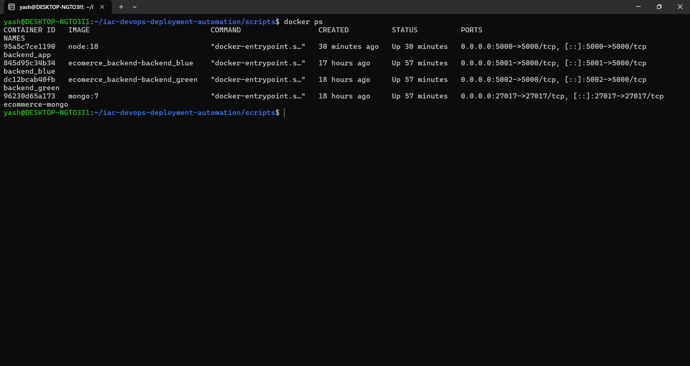
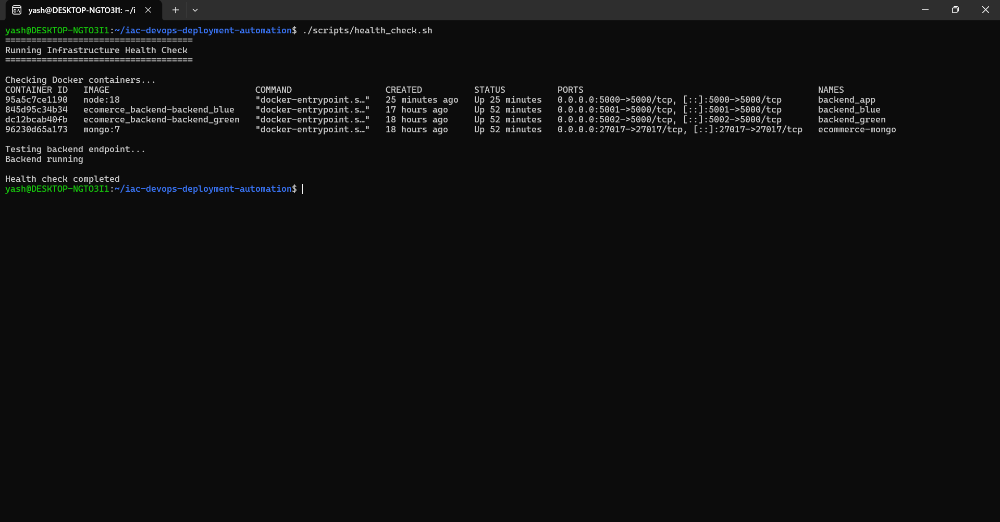
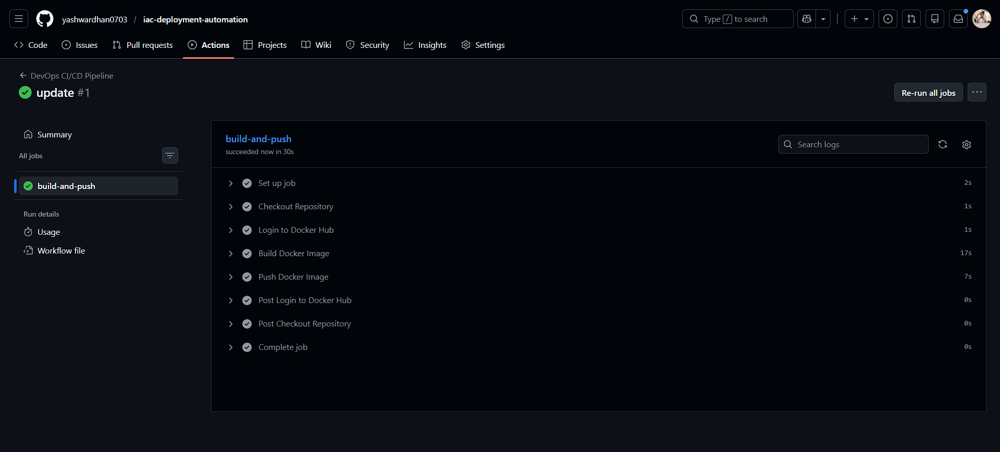
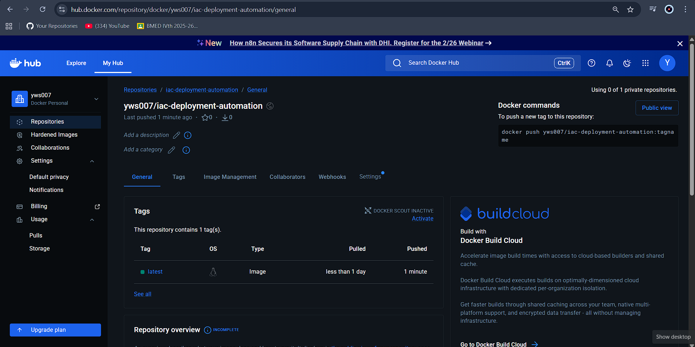

# Infrastructure as Code (IaC) Automation for Production Deployment

## Overview

This project demonstrates **Infrastructure as Code (IaC) automation for deploying containerized applications on a Linux server** using Bash scripts, Docker, and Nginx.

The goal is to **automate server provisioning, dependency validation, and application deployment** with a single command instead of performing manual setup steps.

The architecture and workflow are inspired by **real production deployment practices**, where infrastructure configuration and application deployment must be repeatable, automated, and reliable.

---

## Key Features

* Automated **Infrastructure as Code (IaC)** using Bash scripts
* **Dependency-aware provisioning** (detects existing installations before installing)
* Automated **Docker container deployment**
* **Nginx reverse proxy configuration**
* **Health check automation**
* One-command infrastructure deployment
* Modular infrastructure scripting structure

---

## Architecture

```
Linux Server (Ubuntu)
│
├── Infrastructure Automation (Bash)
│   ├── Dependency checks
│   ├── Docker provisioning
│   └── Nginx provisioning
│
├── Container Runtime
│   ├── Backend container
│   └── MongoDB container
│
└── Reverse Proxy
    └── Nginx routing requests to backend services
```

---

## Project Structure

```
iac-devops-deployment-automation
│
├── docker
│   └── docker-compose.yml
│
├── infrastructure
│   ├── check_dependencies.sh
│   ├── install_docker.sh
│   └── install_nginx.sh
│
├── nginx
│   └── app.conf
│
├── scripts
│   ├── deploy.sh
│   └── health_check.sh
```

### Directory Explanation

| Directory          | Purpose                               |
| ------------------ | ------------------------------------- |
| **infrastructure** | Infrastructure provisioning scripts   |
| **docker**         | Container orchestration configuration |
| **nginx**          | Reverse proxy configuration           |
| **scripts**        | Deployment and monitoring scripts     |

---

## Infrastructure Automation Workflow

The deployment process is fully automated and follows this workflow:

```
Check Dependencies
        ↓
Install Missing Infrastructure
        ↓
Provision Docker Runtime
        ↓
Deploy Containers
        ↓
Run Health Validation
```

---

## Deployment

### Step 1: Clone the Repository

```bash
git clone https://github.com/YOUR_USERNAME/iac-devops-deployment-automation.git
cd iac-devops-deployment-automation
```

### Step 2: Make Scripts Executable

```bash
chmod +x infrastructure/*.sh
chmod +x scripts/*.sh
```

### Step 3: Deploy Infrastructure

```bash
cd scripts
./deploy.sh
```

Example Output:

```
Starting Infrastructure Deployment

Checking dependencies
Docker already installed
Nginx already installed

Installing missing components (if required)

Starting containerized services
Deployment completed successfully
```

---

## Health Check

Validate that the infrastructure and services are running correctly.

```bash
./health_check.sh
```

This script checks:

* Running Docker containers
* Backend endpoint availability

---

## Container Deployment

Containers are orchestrated using **Docker Compose**.

Example services:

* Backend application container
* MongoDB database container

Start containers manually:

```bash
docker compose -f docker/docker-compose.yml up -d
```

---

## Nginx Reverse Proxy

Nginx is used to route incoming traffic to backend services.

Example configuration:

```
server {
    listen 80;

    location / {
        proxy_pass http://localhost:5000;
    }
}
```

---

## Screenshots

### Dependency Validation

The infrastructure script verifies whether required tools are already installed before provisioning them.



---

### Infrastructure Deployment

The `deploy.sh` script automates infrastructure provisioning and container deployment.



---

### Running Containers

Docker containers running successfully after deployment.



---

### Infrastructure Health Check

Health validation script verifying container status and backend availability.



---

### CI/CD Pipeline – Build and Push Docker Image

The GitHub Actions pipeline automatically builds the Docker image and pushes it to Docker Hub whenever code is pushed to the repository.



---

### Docker Image in Docker Hub

The CI/CD pipeline pushes the built Docker image to Docker Hub, making it available for deployment.



---

---

## Technologies Used

* Linux (Ubuntu)
* Bash Scripting
* Docker
* Docker Compose
* Nginx
* Infrastructure as Code (IaC)

---

## DevOps Concepts Demonstrated

This project demonstrates several **core DevOps practices**:

* Infrastructure as Code (IaC)
* Automated server provisioning
* Containerized application deployment
* Reverse proxy configuration
* Automated infrastructure validation
* Reproducible deployment workflows

---

## Use Case

This repository demonstrates how infrastructure automation can be implemented to **replicate a production-style deployment workflow**, enabling engineers to deploy services quickly and consistently across environments.

---

## Future Improvements

Potential enhancements for this project include:

* CI/CD pipeline integration
* Docker image build automation
* Container health monitoring
* Blue-Green deployment automation
* Infrastructure provisioning using Terraform or Ansible

---


